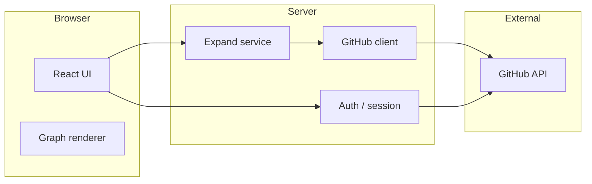

# Target architecture (v0 → v1)

## Logical components



## Responsibilities

| Component | Responsibility |
|-----------|----------------|
| **Auth** | OAuth code exchange; session cookie; attach GitHub access token server-side (encrypted or in DB), never to localStorage if avoidable |
| **Expand service** | Given `rootLogin` and caps, return `GraphDTO` (nodes + edges), merging duplicates by GitHub user id |
| **GitHub client** | Pagination loops, backoff on `403` rate limit, typed errors |
| **Graph renderer** | Layout, interaction, tooltips; **no** direct GitHub calls |

## Suggested API (HTTP)

Frozen-ish for codegen; adjust names to match framework.

### `POST /api/graph/expand`

**Request**

```json
{
  "rootLogin": "octocat",
  "maxFollowers": 100,
  "maxFollowing": 100,
  "includeRootProfile": true
}
```

**Response:** `GraphDTO` (see `data-model-and-github-mapping.md`).

### `GET /api/auth/session` (optional)

Returns `{ user: { login, avatarUrl, name } }` or 401.

## Deployment (typical)

- **App:** Vercel / Netlify / Railway / Fly.io
- **DB:** Neon / Supabase / Railway Postgres
- **Env:** `GITHUB_CLIENT_ID`, `GITHUB_CLIENT_SECRET`, `AUTH_SECRET`, `DATABASE_URL`

## Future extensions (do not build in v0 unless time permits)

- Read-through cache keyed by `(rootLogin, caps fingerprint)`
- Background job for slow expansions
- Read replicas / connection pooling for Postgres
