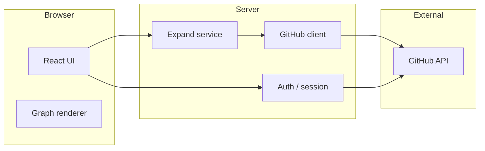

# Target architecture (v0 → v1)

## Logical components



## Responsibilities

| Component | Responsibility |
|-----------|----------------|
| **Auth** | **Supabase Auth** (GitHub OAuth in browser); API verifies **`Authorization: Bearer <supabase_access_token>`**; browser sends **`X-GitHub-Access-Token`** (`session.provider_token`) for GitHub REST (hackathon bridge — tighten later) |
| **Expand service** | `POST /api/graph/expand`: given `rootLogin` + caps, return **`GraphDTO`** (star graph; nodes + directed `follows` edges) |
| **GitHub client** | Pagination loops, backoff on `403` rate limit, typed errors |
| **Graph renderer** | Layout, interaction, tooltips; **no** direct GitHub calls |

## Suggested API (HTTP)

Frozen-ish for codegen; adjust names to match framework.

### `POST /api/graph/expand`

**Request**

```json
{
  "rootLogin": "octocat",
  "maxFollowers": 80,
  "maxFollowing": 80
}
```

Headers: `Authorization: Bearer <supabase_jwt>`, `X-GitHub-Access-Token: <github_oauth_token>`.

(`includeRootProfile` is not used in the shipped handler; root profile is always included.)

**Response:** `GraphDTO` (see `data-model-and-github-mapping.md`).

### `GET /api/auth/session` (optional)

Returns `{ user: { login, avatarUrl, name } }` or 401.

## Deployment (typical)

**Chosen stack (this repo):** Vite **web** + Node **API** + **Supabase** (Postgres + Auth). See [`chosen-tech-stack.md`](chosen-tech-stack.md).

- **Web:** static or SSR host for Vite build (Vercel / Netlify / Cloudflare Pages / S3+CDN — TBD)
- **API:** same platform’s serverless functions **or** Railway / Fly / Render Node process — TBD
- **DB + auth:** **Supabase** (`DATABASE_URL`, Supabase keys; details in `chosen-tech-stack.md`)
- **Env (minimum names):** `DATABASE_URL`, `DIRECT_URL` (if used for migrations), `SUPABASE_URL`, `SUPABASE_ANON_KEY`, server-only `SUPABASE_SERVICE_ROLE_KEY` where justified, plus GitHub/Supabase auth configuration per `github-api-and-auth.md`

## Future extensions (do not build in v0 unless time permits)

- Read-through cache keyed by `(rootLogin, caps fingerprint)`
- Background job for slow expansions
- Read replicas / connection pooling for Postgres
